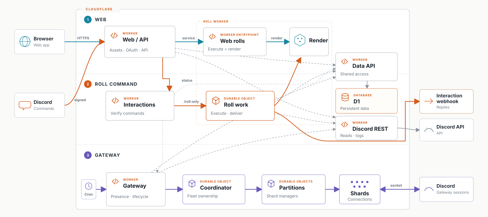
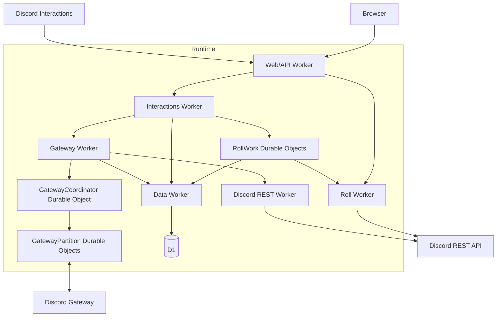

# Dice Witch


Dice Witch is a Discord dice roller with illustrated results, advanced RPG notation, a web dashboard, and durable interaction delivery.

## Architecture

Dice Witch runs as six Workers. Durable Objects coordinate roll delivery and Gateway shards; D1 stores application data.



<details>
<summary>Text architecture map</summary>



</details>

- Signed HTTP interactions own commands; Gateway owns presence, sessions, shards, and guild lifecycle.
- `RollWork` Durable Objects execute idempotent Discord deliveries.
- The Data Worker exclusively owns D1; other Workers use service bindings.
- The Web/API Worker serves the Vite application, OAuth routes, API routes, and `/interactions`.

## Repository

- `cloudflare/` — Workers, Durable Objects, shared packages, D1 migrations, tests, and Wrangler examples.
- `frontend/` — React and Vite web application.
- `architecture.svg` — vendor-neutral runtime diagram.

## Requirements

- Node.js 24.13 and npm 11.6
- A Cloudflare account with Wrangler authenticated
- A Discord application and bot
- Six Worker names or routes under your control

## Local setup

```bash
npm ci
cp cloudflare/wrangler.data.example.jsonc cloudflare/wrangler.data.jsonc
cp cloudflare/wrangler.discord-rest.example.jsonc cloudflare/wrangler.discord-rest.jsonc
cp cloudflare/wrangler.gateway.example.jsonc cloudflare/wrangler.gateway.jsonc
cp cloudflare/wrangler.interactions.example.jsonc cloudflare/wrangler.interactions.jsonc
cp cloudflare/wrangler.roll.example.jsonc cloudflare/wrangler.roll.jsonc
cp cloudflare/wrangler.web-api.example.jsonc cloudflare/wrangler.web-api.jsonc
cp frontend/.env.example frontend/.env.local
```

The non-example Wrangler files and `.env.local` are ignored. Replace every placeholder in those files. If you change a Worker name, update every corresponding service binding.

Required application values include:

- Discord application ID and public key
- Discord OAuth client ID, client secret, and callback URL
- Public frontend origin and web app URL
- Invite, support, and audit-log channel URLs/IDs
- D1 database name and ID
- Gateway mode, hostname, and partition capacities

## Initialize D1

Create an empty database and copy the returned name and ID into `cloudflare/wrangler.data.jsonc`:

```bash
npx wrangler d1 create dice-witch-data
npx wrangler d1 migrations apply dice-witch-data \
  --remote \
  --config cloudflare/wrangler.data.jsonc
```

The committed migrations initialize a new deployment directly. They do not require a legacy database or data import.

## Configure secrets

Store secrets with Wrangler or bind equivalent Secrets Store entries. The application fails closed when a required secret is absent.

```bash
npx wrangler secret put DISCORD_BOT_TOKEN --config cloudflare/wrangler.discord-rest.jsonc
npx wrangler secret put TOPGG_KEY --config cloudflare/wrangler.discord-rest.jsonc
npx wrangler secret put DISCORD_BOT_LIST_KEY --config cloudflare/wrangler.discord-rest.jsonc

npx wrangler secret put DISCORD_BOT_TOKEN --config cloudflare/wrangler.gateway.jsonc
npx wrangler secret put GATEWAY_CONTROL_TOKEN --config cloudflare/wrangler.gateway.jsonc

npx wrangler secret put DISCORD_PUBLIC_KEY --config cloudflare/wrangler.interactions.jsonc
npx wrangler secret put DISCORD_CLIENT_SECRET --config cloudflare/wrangler.web-api.jsonc
```

## Build and deploy

Build the frontend with the same public origin and Discord application ID configured in the Web/API Worker:

```bash
VITE_API_BASE=https://your-domain.example \
VITE_DISCORD_CLIENT_ID=YOUR_DISCORD_APPLICATION_ID \
npm run build
```

Deploy in dependency order:

```bash
npx wrangler deploy --config cloudflare/wrangler.data.jsonc
npx wrangler deploy --config cloudflare/wrangler.discord-rest.jsonc
npx wrangler deploy --config cloudflare/wrangler.roll.jsonc
npx wrangler deploy --config cloudflare/wrangler.gateway.jsonc
npx wrangler deploy --config cloudflare/wrangler.interactions.jsonc
npx wrangler deploy --config cloudflare/wrangler.web-api.jsonc
```

Register the five Discord commands without exposing the bot token in command arguments:

```bash
export DISCORD_APPLICATION_ID=YOUR_DISCORD_APPLICATION_ID
read -rsp "Discord bot token: " DISCORD_BOT_TOKEN && echo
export DISCORD_BOT_TOKEN
npm run commands:register --workspace=@dice-witch/cloudflare
unset DISCORD_BOT_TOKEN
```

Set `DISCORD_COMMAND_GUILD_ID` before that command to register guild-scoped commands for development instead of global commands.

Set Discord's Interaction Endpoint URL to:

```text
https://your-domain.example/interactions
```

Set the OAuth callback URL to:

```text
https://your-domain.example/api/auth/callback/discord
```

Finally, start the Gateway through its authenticated control endpoint:

```bash
curl --fail-with-body \
  --request POST \
  --header "Authorization: Bearer $GATEWAY_CONTROL_TOKEN" \
  https://YOUR_GATEWAY_WORKER/gateway/start
```

## Verification

```bash
npm run type-check
npm run lint
npm test

VITE_API_BASE=http://localhost:8787 \
VITE_DISCORD_CLIENT_ID=100000000000000001 \
npm run build
```

Each committed `wrangler.*.example.jsonc` also supports `wrangler deploy --dry-run` after the frontend build.

## License

[MIT](LICENSE)
