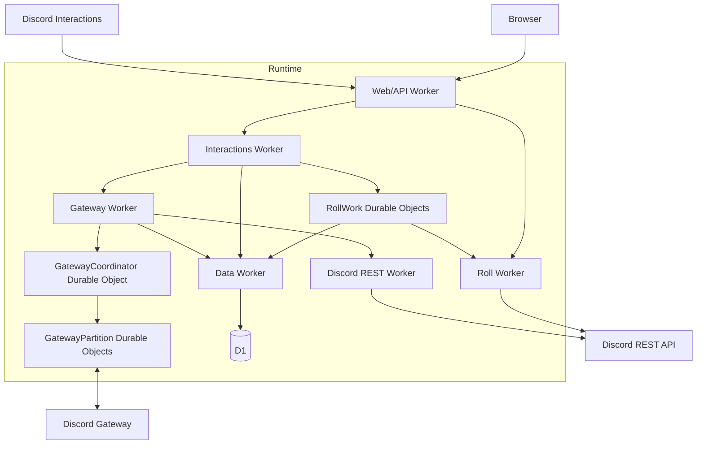

# Dice Witch


[](https://top.gg/bot/808161585876697108)

Dice Witch is a Discord dice roller that aims to simulate the experience of rolling Dice IRL. It literally shows you the dice. 

## Architecture

Dice Witch runs on six Cloudflare Workers. Durable Objects coordinate roll delivery and Gateway shards. D1 stores application data.



Signed HTTP interactions handle commands. The Gateway handles presence, sessions, shards, and guild lifecycle events.

`RollWork` Durable Objects make Discord delivery idempotent. The Data Worker is the only Worker with direct access to D1. Everything else talks to it through service bindings.

The Web/API Worker serves the React application, OAuth and API routes, and the `/interactions` endpoint.

## Repository

- `cloudflare/`: Workers, Durable Objects, shared packages, D1 migrations, tests, and Wrangler examples
- `frontend/`: React and Vite application

## Requirements

- Node.js 24.13
- npm 11.6
- A Cloudflare account with Wrangler authenticated
- A Discord application and bot

## Local setup

Install dependencies and copy the example configuration files:

```bash
npm ci

cp cloudflare/wrangler.data.example.jsonc cloudflare/wrangler.data.jsonc
cp cloudflare/wrangler.discord-rest.example.jsonc cloudflare/wrangler.discord-rest.jsonc
cp cloudflare/wrangler.gateway.example.jsonc cloudflare/wrangler.gateway.jsonc
cp cloudflare/wrangler.interactions.example.jsonc cloudflare/wrangler.interactions.jsonc
cp cloudflare/wrangler.roll.example.jsonc cloudflare/wrangler.roll.jsonc
cp cloudflare/wrangler.web-api.example.jsonc cloudflare/wrangler.web-api.jsonc
cp frontend/.env.example frontend/.env.local
```

The copied Wrangler files and `.env.local` are ignored by Git.

Replace every placeholder. If you rename a Worker, update every service binding that points to it.

You will need:

- Discord application ID and public key
- Discord OAuth client ID, client secret, and callback URL
- Public frontend origin and web app URL
- Invite, support, and audit log channel URLs or IDs
- D1 database name and ID
- Gateway mode, hostname, and partition capacities

## Initialize D1

Create an empty D1 database:

```bash
npx wrangler d1 create dice-witch-data
```

Copy the returned database name and ID into `cloudflare/wrangler.data.jsonc`, then apply the migrations:

```bash
npx wrangler d1 migrations apply dice-witch-data \
  --remote \
  --config cloudflare/wrangler.data.jsonc
```

The committed migrations can initialize a fresh deployment directly. No legacy database or data import is required.

## Configure secrets

Add each secret to the Worker that uses it:

```bash
npx wrangler secret put DISCORD_BOT_TOKEN --config cloudflare/wrangler.discord-rest.jsonc
npx wrangler secret put TOPGG_KEY --config cloudflare/wrangler.discord-rest.jsonc
npx wrangler secret put DISCORD_BOT_LIST_KEY --config cloudflare/wrangler.discord-rest.jsonc

npx wrangler secret put DISCORD_BOT_TOKEN --config cloudflare/wrangler.gateway.jsonc
npx wrangler secret put GATEWAY_CONTROL_TOKEN --config cloudflare/wrangler.gateway.jsonc

npx wrangler secret put DISCORD_PUBLIC_KEY --config cloudflare/wrangler.interactions.jsonc
npx wrangler secret put DISCORD_CLIENT_SECRET --config cloudflare/wrangler.web-api.jsonc
```

Secrets Store bindings also work. The application will refuse to run if a required secret is missing.

## Build and deploy

Build the frontend using the same public origin and Discord application ID configured in the Web/API Worker:

```bash
VITE_API_BASE=https://your-domain.example \
VITE_DISCORD_CLIENT_ID=YOUR_DISCORD_APPLICATION_ID \
npm run build
```

Deploy the Workers in dependency order:

```bash
npx wrangler deploy --config cloudflare/wrangler.data.jsonc
npx wrangler deploy --config cloudflare/wrangler.discord-rest.jsonc
npx wrangler deploy --config cloudflare/wrangler.roll.jsonc
npx wrangler deploy --config cloudflare/wrangler.gateway.jsonc
npx wrangler deploy --config cloudflare/wrangler.interactions.jsonc
npx wrangler deploy --config cloudflare/wrangler.web-api.jsonc
```

Wrangler creates each Worker during deployment. You do not need to create them separately.

## Register Discord commands

```bash
export DISCORD_APPLICATION_ID=YOUR_DISCORD_APPLICATION_ID
read -rsp "Discord bot token: " DISCORD_BOT_TOKEN && echo
export DISCORD_BOT_TOKEN

npm run commands:register --workspace=@dice-witch/cloudflare

unset DISCORD_BOT_TOKEN
```

For development, set `DISCORD_COMMAND_GUILD_ID` before running the command. This registers the commands to one guild instead of globally.

Set the Discord Interaction Endpoint URL to:

```text
https://your-domain.example/interactions
```

Set the OAuth callback URL to:

```text
https://your-domain.example/api/auth/callback/discord
```

Start the Gateway through its authenticated control endpoint:

```bash
curl --fail-with-body \
  --request POST \
  --header "Authorization: Bearer $GATEWAY_CONTROL_TOKEN" \
  https://YOUR_GATEWAY_WORKER/gateway/start
```

## License

[MIT](LICENSE)
